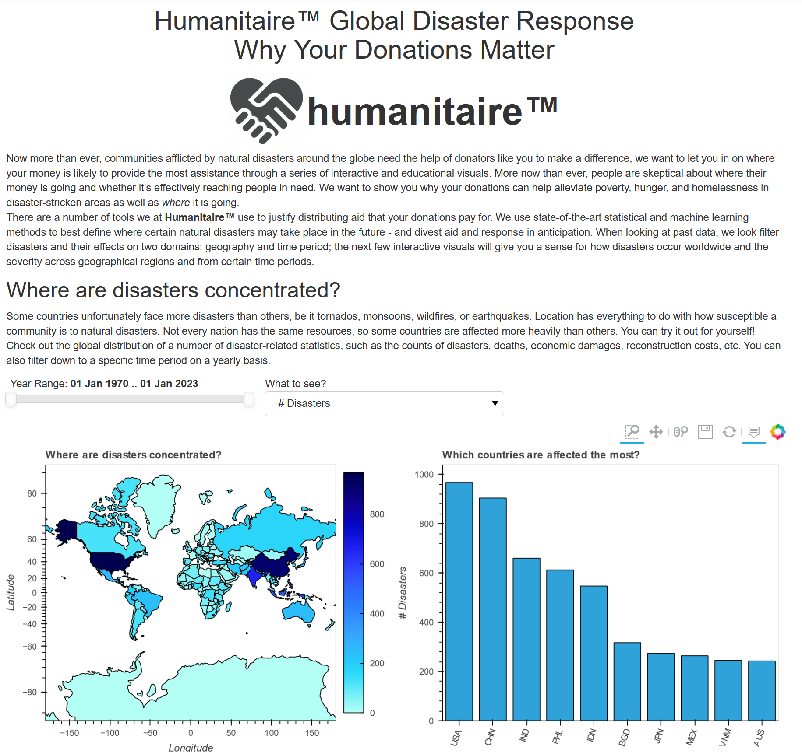
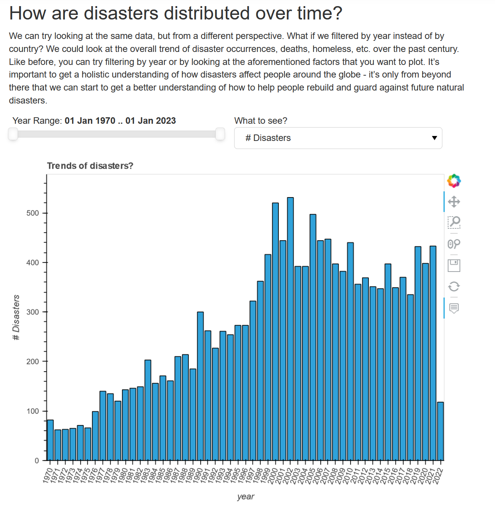
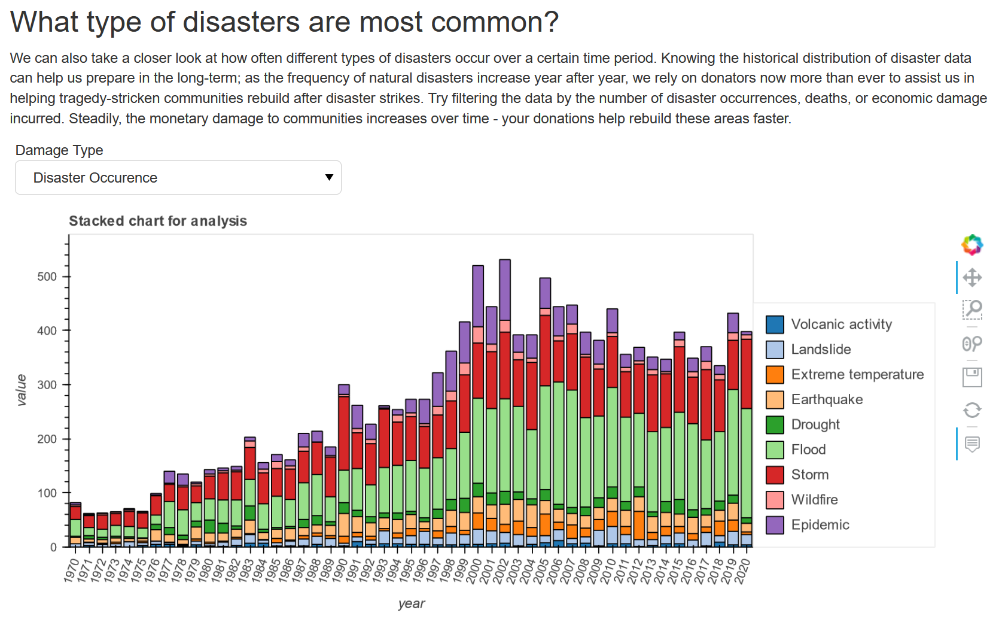
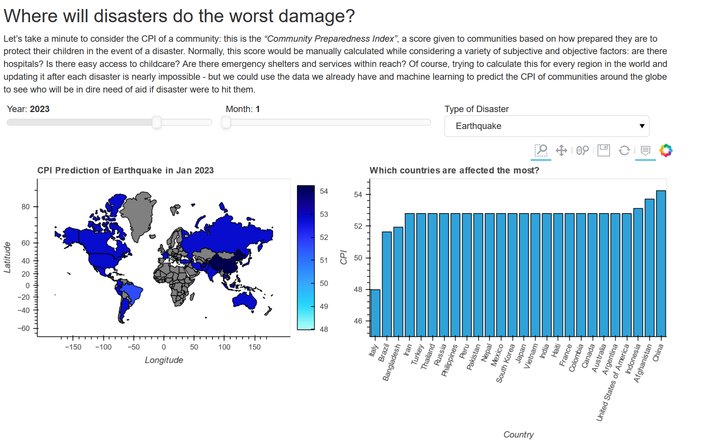
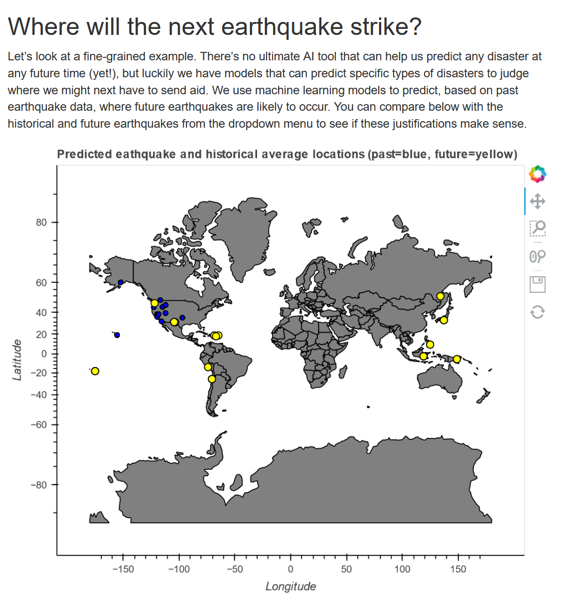

<h1>Natural Disaster Analysis & Response</h1>




<h2>Team Members</h2>

By Pujika Kumar, Ruining Feng, Cameron Lewis, Emily Park, Sri Shatagopam, Yue Wu, Siyuan Zhang


<h2>Question to Investigate</h2>

We will be investigating the consequences of natural disasters both on a regional and global scale in terms of human and economic impact (i.e. from deaths and homeless statistics to economic damage) based on the geographical origin, timeframe of the disaster, etc.


<h2>User Story</h2>

As a non-profit organization we want our end users/donators to understand the importance of our work. Our goal is to convince English speaking potential donors to donate to our company so we can continue our company’s mission: “help others through providing humanitarian aid.” 
Through our dashboard we can educate potential donors on the magnitude of damage that natural disasters can cause. Utilizing interactive visuals provide a digestible way to learn the impact of natural disasters around the world such as the number of deaths, and monetary damage.


<h2>Dataset</h2>

<a href="https://www.emdat.be/">EM-DAT – The International Disaster Database<a>
Dataset Description: EM-DAT is a catalog of disasters listing detailed information on natural disasters: droughts (famines), earthquakes, epidemics, extreme temperatures, floods, insect infestations, mass movement (dry & wet), storms, volcanos, and wildfires. There is also a data section on technological disasters.


Geographical coverage: Global – country and regional level (primarily cross-country data set, but also contains the name of the sub-national regions affected by disasters)
Time span: 1900 onwards.
Interactive visuals 

<h2>Required Packages</h2>

* pandas

```
pip install pandas
```

* numpy

```
pip install numpy
```

* geopandas

```
pip install geopandas
```
  
* geoviews

```
pip install geoviews
```
* voila

```
pip install voila
```
  
* holoviews

```
pip install holoviews
```
  
* bokeh

```
pip install bokeh
```

* xgboost

```
pip install xgboost
```

<h2> Machine Learning Models </h2>

1. Future CPI Prediction
  Make a CPI prediction of different disasters in the future.
  
  Prediction Obejective: CPI(Community Preparedness Index) Score of how prepared a community is to aid children in a disaster; computed across multiple sectors (hospitals, emergency shelters, child care, etc.).
  
  Dataset: <a href="https://www.emdat.be/">EM-DAT – The International Disaster Database<a>
  
  Model: xgboost
  
  `objective = reg:squarederror` regression with squared loss

2. Earthquake Location Prediction in Next 7 Days
  
  Make a earhtquake location prediction in next 7 days.
  
  Prediction Obejective: Probability of earthquake(magnitude > 2.5) occurrence.
  
  Dataset: <a href="https://earthquake.usgs.gov/earthquakes/feed/v1.0/summary/all_month.csv">USGS Earthquake<a>
  
  Model: xgboost
  
  `objective = reg: binary:logistic` logistic regression for binary classification, output probability(magnitude > 2.5)
 
3. Future Work
  
  Dataset: Get more data OR use MICE to the missings in EM-DAT dataset(too many missings affect the model performance).
  
  Models: Test with data-insensitive methods (e.g. Bayesian networks) and neural networks.

<h2> Visualizations</h2>
[Visualization Notebook](https://github.com/srishatagopam/ECE-229-Natural-Disasters-and-Response/blob/main/Group7_Final_notebook.ipynb)
  

<h2> Documentation</h2>

Built with Sphinx; preview available <a href="https://htmlpreview.github.io/?https://github.com/srishatagopam/ECE-229-Natural-Disasters-and-Response/blob/main/docs/build/html/index.html#disaster-analysis-temporal"> here.<a>
  
<h2> Coverage Report</h2>
Testing done using PyTest, coverage report created using coverage. Preview available <a href="https://htmlpreview.github.io/?https://github.com/srishatagopam/ECE-229-Natural-Disasters-and-Response/blob/main/htmlcov/index.html"> here.<a>

<h2> AWS guide </h2>

1.EC2 setup

Create an EC2 instance on Amazon AWS. The "t2 micro" tier is enough for this project and it is free. We add a security group to our instance, then save the "pem" file to the local machine. You can then connect to the ec2 instance and install the above packages through pip or miniconda. 


2.Git clone the repository from github to EC2 with:

```
git clone https://github.com/srishatagopam/ECE-229-Natural-Disasters-and-Response.git
```
  
3.Use voila to run the file you want to render as a web page on AWS:
  
```
voila Group7_Final_notebook.ipynb
```

Then you should see a web page on your browser localhost.

4.Connection guide

How to connect to EC2 instance:

```
ssh ec2-user@54.215.248.243
```
  
How to open jupyter notebook rendered by voila: 

Create a private key .pem file, such as the one in our repository

Save this file to a local directory, run the following command:

```
ssh -i ece229.pem -L 8866:localhost:8866 ec2-user@54.215.248.243 -v -N
```

Open localhost:8866 on your browser

<h2> Screenshots of Visualization Notebook</h2>








<h2>Citations</h2>
This project was built off of the ECE 143 project linked here: https://github.com/js-konda/NaturalDisastersEDA
One of the authors of this project also wrote the ECE 143 project: Pujika Kumar.
